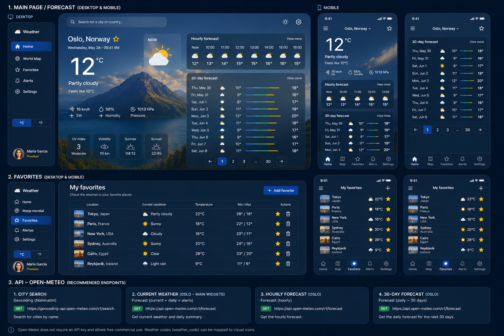

# 🌤️ WF-24 · Weather Forecast

> Sprint #24

---

# 📋 Issue Details

| Field        | Value                                              |
| ------------ | -------------------------------------------------- |
| **Type**     | Feature                                            |
| **Status**   | 🟡 To Do                                           |
| **Priority** | High                                               |
| **Sprint**   | Sprint #24                                         |
| **Reporter** | Product Team                                       |
| **Assignee** | Unassigned                                         |
| **Labels**   | `frontend` `react` `typescript` `intern` `weather` |

---

# Description

Over the last few months we've received several customer requests asking for a simple and modern way to check weather forecasts around the world.

The Design Team has prepared the first version of the user interface and we'd like to build the MVP during this sprint.

Your goal is to implement the application following the attached mockup.

---

# Sprint Goal

Deliver the first MVP of the Weather Forecast application.

Users should be able to:

- Search any city worldwide.
- Display current weather information.
- View hourly and 30-day forecasts.
- Save favorite cities.
- Browse the 30-day forecast using pagination.

The implementation should follow the provided design while keeping the project clean, maintainable and easy to understand.

---

# 📎 Design

Use the following mockup as the design reference.

> The design should be considered as guidance rather than a pixel-perfect specification.



---

# 💬 Comments

### 👩 Product Team

> We'd love to include this feature in our next release.
>
> The objective is not to build the perfect weather application, but to deliver a clean MVP that provides a great user experience.

---

### 🎨 Design Team

> The attached mockup should be used as guidance.
>
> Feel free to make reasonable UX decisions whenever something isn't explicitly designed.

---

### 👨‍💻 Frontend Team

> Welcome aboard! 👋
>
> Don't worry about building something perfect.
>
> We're much more interested in how you think, organize your code and explain your decisions than in the number of features implemented.
>
> Feel free to use any AI-assisted development tools you normally use. During the Sprint Review we'll ask you to explain your implementation and the decisions you've made.

---

# 🎯 Epic

## Weather Forecast MVP

The following User Stories belong to this Epic.

---

# 📚 Product Backlog

---

# 🔴 US-001 · Search for a City

## User Story

**As a** user

**I want** to search for any city

**So that** I can view its weather forecast.

### Acceptance Criteria

- [ ] Search input available
- [ ] Matching cities displayed
- [ ] Selecting a city loads the forecast
- [ ] Loading state handled
- [ ] Error state handled

### Sub-tasks

- [ ] WF-25 · Build Search component
- [ ] WF-26 · Integrate Geocoding API
- [ ] WF-27 · Display search suggestions
- [ ] WF-28 · Handle loading and error states

---

# 🔴 US-002 · Display Weather Forecast

## User Story

**As a** user

**I want** to view weather information

**So that** I know the current conditions and upcoming forecast.

### Acceptance Criteria

- [ ] Current temperature
- [ ] Weather condition
- [ ] Feels like temperature
- [ ] Humidity
- [ ] Pressure
- [ ] Wind speed
- [ ] Hourly forecast
- [ ] 30-day forecast

### Sub-tasks

- [ ] WF-29 · Integrate Forecast API
- [ ] WF-30 · Build Weather Hero component
- [ ] WF-31 · Build Hourly Forecast component
- [ ] WF-32 · Build 30-day Forecast component

---

# 🟠 US-003 · Favorite Cities

## User Story

**As a** user

**I want** to save favorite cities

**So that** I can quickly access them later.

### Acceptance Criteria

- [ ] Add favorite
- [ ] Remove favorite
- [ ] Prevent duplicates
- [ ] Favorites persist between sessions

### Sub-tasks

- [ ] WF-33 · Favorite button
- [ ] WF-34 · Favorites state management
- [ ] WF-35 · Favorites persistence

---

# 🟠 US-004 · 30-day Forecast Pagination

## User Story

**As a** user

**I want** to browse the 30-day forecast using pagination

**So that** I can easily explore upcoming weather conditions.

### Acceptance Criteria

- [ ] Pagination implemented
- [ ] Previous / Next navigation
- [ ] Current page indicator
- [ ] Empty state

### Sub-tasks

- [ ] WF-36 · Build Forecast Pagination component
- [ ] WF-37 · Forecast pagination logic
- [ ] WF-38 · Forecast empty state

---

# 🟢 US-005 · Responsive Layout (Optional)

## User Story

**As a** user

**I want** to use the application on mobile devices

**So that** I have a consistent experience across different screen sizes.

> **This User Story is optional.**
>
> Completing this story is **not required** to successfully finish the challenge and will **not negatively affect your evaluation** if left unimplemented.
>
> If you have additional time, feel free to implement it.

### Acceptance Criteria

- [ ] Mobile layout
- [ ] Responsive navigation
- [ ] Responsive weather cards
- [ ] Responsive favorites page

### Sub-tasks

- [ ] WF-39 · Responsive layout
- [ ] WF-40 · Responsive navigation
- [ ] WF-41 · Responsive weather cards
- [ ] WF-42 · Responsive favorites page

---

# 🛠 Technical Notes

## Requirements

The application must be developed using:

- React
- TypeScript

You are free to choose:

- Project structure
- Libraries
- State management solution
- Styling solution
- Weather API
- Persistence strategy

We value clean architecture, readable code and maintainable solutions over feature quantity.

---

## Git

Please work as you normally would in a professional environment.

We encourage:

- Creating a feature branch for your implementation.
- Writing small and meaningful commits.
- Using clear and descriptive commit messages.

The quality of your Git history is not a deciding factor, but it helps us understand your development process.

---

# 🌐 Resources

You are free to choose any public Weather API.

We recommend **Open-Meteo**, as it provides all the data required for this challenge without requiring an API key.

Official documentation: https://open-meteo.com/en/docs

---

## Geocoding API

Used to search cities by name and get their coordinates.

**Base URL:** `https://geocoding-api.open-meteo.com/v1/search`

| Parameter  | Type   | Description                                        |
| ---------- | ------ | -------------------------------------------------- |
| `name`     | string | City name to search (e.g. `Barcelona`)             |
| `count`    | number | Max number of results (e.g. `5`)                   |
| `language` | string | Language for the results (e.g. `en`)               |

**Example request:**

```
GET https://geocoding-api.open-meteo.com/v1/search?name=Barcelona&count=5&language=en
```

**Example response (simplified):**

```json
{
  "results": [
    {
      "id": 3128760,
      "name": "Barcelona",
      "country": "Spain",
      "country_code": "ES",
      "latitude": 41.38879,
      "longitude": 2.15899
    }
  ]
}
```

Use `latitude` and `longitude` from this response as input for the Forecast API.

---

## Forecast API

Used to retrieve current conditions and forecasts for a given location.

**Base URL:** `https://api.open-meteo.com/v1/forecast`

| Parameter       | Type   | Description                                                                          |
| --------------- | ------ | ------------------------------------------------------------------------------------ |
| `latitude`      | number | Latitude from Geocoding API                                                          |
| `longitude`     | number | Longitude from Geocoding API                                                         |
| `current`       | string | Comma-separated current weather variables                                            |
| `hourly`        | string | Comma-separated hourly forecast variables                                            |
| `daily`         | string | Comma-separated daily forecast variables                                             |
| `forecast_days` | number | Days ahead to forecast (max `16`)                                                    |
| `past_days`     | number | Past days to include — combine with `forecast_days` to cover 30 days                |
| `timezone`      | string | Use `auto` to detect from location                                                   |

**Suggested variables for this challenge:**

- `current`: `temperature_2m`, `apparent_temperature`, `relative_humidity_2m`, `surface_pressure`, `wind_speed_10m`, `weather_code`
- `hourly`: `temperature_2m`, `weather_code`
- `daily`: `temperature_2m_max`, `temperature_2m_min`, `weather_code`

**Example request:**

```
GET https://api.open-meteo.com/v1/forecast
  ?latitude=41.38879
  &longitude=2.15899
  &current=temperature_2m,apparent_temperature,relative_humidity_2m,surface_pressure,wind_speed_10m,weather_code
  &hourly=temperature_2m,weather_code
  &daily=temperature_2m_max,temperature_2m_min,weather_code
  &forecast_days=16
  &past_days=14
  &timezone=auto
```

**Example response (simplified):**

```json
{
  "current": {
    "temperature_2m": 22.4,
    "apparent_temperature": 21.1,
    "relative_humidity_2m": 65,
    "surface_pressure": 1015.2,
    "wind_speed_10m": 12.3,
    "weather_code": 3
  },
  "hourly": {
    "time": ["2025-06-01T00:00", "2025-06-01T01:00"],
    "temperature_2m": [18.2, 17.8],
    "weather_code": [1, 1]
  },
  "daily": {
    "time": ["2025-06-01", "2025-06-02"],
    "temperature_2m_max": [24.1, 23.5],
    "temperature_2m_min": [15.2, 14.8],
    "weather_code": [3, 61]
  }
}
```

**Weather codes** follow the WMO standard. You can find the full list in the Open-Meteo docs under _"Weather variable documentation"_. Implement a mapping from code to label and icon (e.g. `0` → Clear sky, `61` → Rain, `71` → Snow).

---

# 🚚 Ready for Review

Before the Sprint Review, your submission should include:

- Source code
- Git history
- A README including:
  - Setup instructions
  - How to run the project locally
  - Project architecture
  - Technical decisions
  - Improvements you would make with more time
  - AI tools used during development

---

# 🎯 Evaluation

We'll mainly evaluate:

- Problem-solving approach
- Code quality
- Project architecture
- Maintainability
- Communication during the Sprint Review

The challenge is intentionally open-ended.

There isn't a single "correct" solution, and we're more interested in your reasoning than in the specific technologies you choose.

---

# ✅ Definition of Done

The challenge will be considered complete when:

- [ ] All required User Stories are completed
- [ ] Application builds successfully
- [ ] No visible runtime errors
- [ ] README completed
- [ ] Ready for Sprint Review

---

# 🚀 Next Step

Once you've submitted your solution we'll schedule a **Sprint Review** with the Frontend Team.

Before the meeting, please complete:

📄 `docs/sprint-review.md`

We'll use that document to guide our conversation.

During the Sprint Review we'd like to discuss:

- Your project architecture.
- Your technical decisions.
- How you approached the challenge.
- Trade-offs you made.
- AI tools you used during development.
- Improvements you would implement in a future sprint.

Feel free to use your code during the meeting.

We're interested in understanding:

- How you think.
- How you solve problems.
- How you communicate your decisions.

Good luck, and enjoy building it! 🚀
