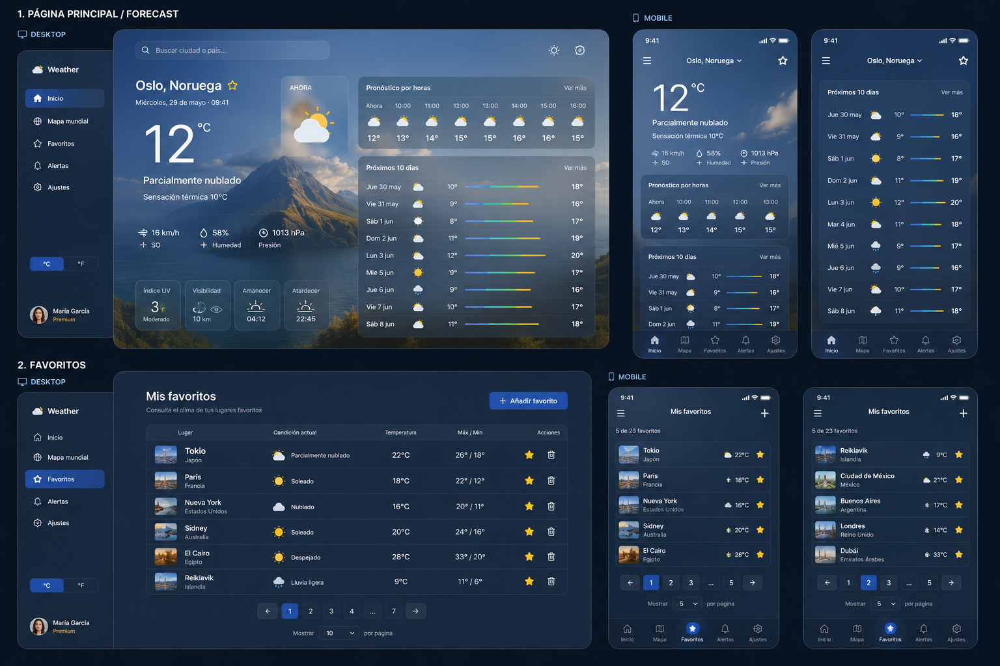

# 🌤️ WF-24 · Weather Forecast MVP

> Sprint #24

---

# 📋 Issue Details

| Field            | Value                                              |
| ---------------- | -------------------------------------------------- |
| **Type**         | Feature                                            |
| **Status**       | 🟡 To Do                                           |
| **Priority**     | High                                               |
| **Sprint**       | Sprint #24                                         |
| **Story Points** | 8                                                  |
| **Reporter**     | Product Team                                       |
| **Assignee**     | You                                                |
| **Labels**       | `frontend` `react` `typescript` `intern` `weather` |

---

# Description

Over the last few months we've received several customer requests asking for a simple and modern way to check weather forecasts around the world.

The Design Team has prepared the first version of the user interface and we'd like to build the MVP during this sprint.

Your goal is to implement the application following the attached mockup.

---

# Sprint Goal

Deliver the first MVP of the Weather Forecast application.

Users should be able to:

- Search any city worldwide.
- Display current weather information.
- View hourly and daily forecasts.
- Save favorite cities.
- Browse favorite cities using pagination.

The implementation should follow the provided design while keeping the project clean, maintainable and easy to understand.

---

# 📎 Design

Use the following mockup as the design reference.

> The design should be considered as guidance rather than a pixel-perfect specification.

---

# 💬 Comments

### 👩 Product Team

> We'd love to include this feature in our next release.
>
> The objective is not to build the perfect weather application, but to deliver a clean MVP that provides a great user experience.

---

### 🎨 Design Team

> The attached mockup should be used as guidance.
>
> Feel free to make reasonable UX decisions whenever something isn't explicitly designed.

---

### 👨‍💻 Frontend Team

> Welcome aboard! 👋
>
> Don't worry about building something perfect.
>
> We're much more interested in how you think, organize your code and explain your decisions than in the number of features implemented.
>
> Feel free to use any AI-assisted development tools you normally use. During the Sprint Review we'll ask you to explain your implementation and the decisions you've made.

---

# 🎯 Epic

## Weather Forecast MVP

The following User Stories belong to this Epic.

---

# 📚 Product Backlog

---

# 🔴 US-001 · Search for a City

## User Story

**As a** user

**I want** to search for any city

**So that** I can view its weather forecast.

### Acceptance Criteria

- [ ] Search input available
- [ ] Matching cities displayed
- [ ] Selecting a city loads the forecast
- [ ] Loading state handled
- [ ] Error state handled

### Sub-tasks

- [ ] WF-25 · Build Search component
- [ ] WF-26 · Integrate Geocoding API
- [ ] WF-27 · Display search suggestions
- [ ] WF-28 · Handle loading and error states

---

# 🔴 US-002 · Display Weather Forecast

## User Story

**As a** user

**I want** to view weather information

**So that** I know the current conditions.

### Acceptance Criteria

- [ ] Current temperature
- [ ] Weather condition
- [ ] Feels like temperature
- [ ] Humidity
- [ ] Pressure
- [ ] Wind speed
- [ ] Hourly forecast
- [ ] Multi-day forecast

### Sub-tasks

- [ ] WF-29 · Integrate Forecast API
- [ ] WF-30 · Build Weather Hero component
- [ ] WF-31 · Build Hourly Forecast component
- [ ] WF-32 · Build Daily Forecast component

---

# 🟠 US-003 · Favorite Cities

## User Story

**As a** user

**I want** to save favorite cities

**So that** I can quickly access them later.

### Acceptance Criteria

- [ ] Add favorite
- [ ] Remove favorite
- [ ] Prevent duplicates
- [ ] Persist using Local Storage

### Sub-tasks

- [ ] WF-33 · Favorite button
- [ ] WF-34 · Favorites storage
- [ ] WF-35 · Local Storage integration

---

# 🟠 US-004 · Favorites Pagination

## User Story

**As a** user

**I want** to browse my favorite cities

**So that** I can manage a long list.

### Acceptance Criteria

- [ ] Pagination implemented
- [ ] Previous / Next navigation
- [ ] Current page indicator
- [ ] Empty state

### Sub-tasks

- [ ] WF-36 · Build Pagination component
- [ ] WF-37 · Pagination logic
- [ ] WF-38 · Empty state

---

# 🟢 US-005 · Responsive Layout (Optional)

## User Story

**As a** user

**I want** to use the application on mobile devices

**So that** I have a consistent experience across different screen sizes.

> **This User Story is optional.**
>
> Completing this story is **not required** to successfully finish the challenge and will **not negatively affect your evaluation** if left unimplemented.
>
> If you have additional time, feel free to implement it.

### Acceptance Criteria

- [ ] Mobile layout
- [ ] Responsive navigation
- [ ] Responsive weather cards
- [ ] Responsive favorites page

### Sub-tasks

- [ ] WF-39 · Responsive layout
- [ ] WF-40 · Responsive navigation
- [ ] WF-41 · Responsive weather cards
- [ ] WF-42 · Responsive favorites page

---

# 🛠 Technical Notes

## Requirements

The application must be developed using:

- React
- TypeScript

You are free to choose:

- Project structure
- Libraries
- State management solution
- Styling solution
- Weather API

We value clean architecture, readable code and maintainable solutions over feature quantity.

---

# 📦 Deliverables

Please submit:

- Source code
- Git history
- A README including:
  - Setup instructions
  - Project architecture
  - Technical decisions
  - Improvements you would make with more time
  - AI tools used during development

---

# ✅ Definition of Done

The challenge will be considered complete when:

- [ ] All required User Stories are completed
- [ ] Application builds successfully
- [ ] No visible runtime errors
- [ ] README completed
- [ ] Ready for Sprint Review

---

# 🚀 Next Step

Once you've submitted your solution we'll schedule a **Sprint Review** with the Frontend Team.

Before the meeting, please complete:

📄 `submission/SPRINT_REVIEW.md`

We'll use that document to guide our conversation.

During the Sprint Review we'd like to discuss:

- Your project architecture.
- Your technical decisions.
- How you approached the challenge.
- Trade-offs you made.
- AI tools you used during development.
- Improvements you would implement in a future sprint.

Feel free to use your code during the meeting.

We're interested in understanding **how you think**, **how you solve problems**, and **how you communicate your decisions**.
